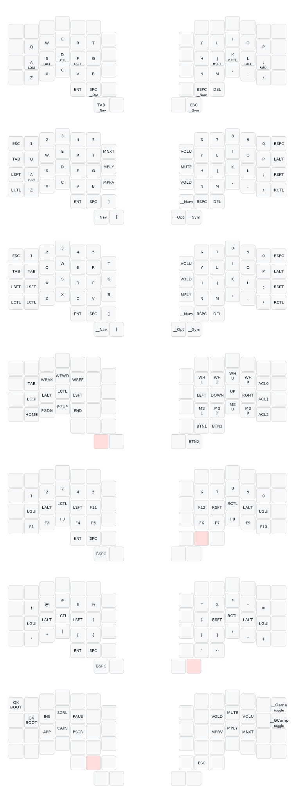

# IBKBD

_Ibrahim's Keyboard_

- Custom physical layout, PCB, Case, and keymap
- 4x6 + 5 + 3 _(Inspired heavily by [Dygma Defy](https://dygma.com/products/dygma-defy))_
- Generic DSA keycaps
- Kailh Midnight Pro Silent Tactile Switches
- Pro Micro ATmega32U4 with type C port

Originally, I was using all the keys in my base layer when i started my journey in ergonomic keyboards. Over time I was able to learn to use less keys and rely on better layer management. Though gaming is still best achieved when using the full board size. Current default layout is inspired by [Miryoku](https://github.com/manna-harbour/miryoku). My original keymap that used all keys on the board is saved in the "full" keymap.c file

#### In this project

- kicad pcb files
- 3D case files
- qmk configuration
- kle input

