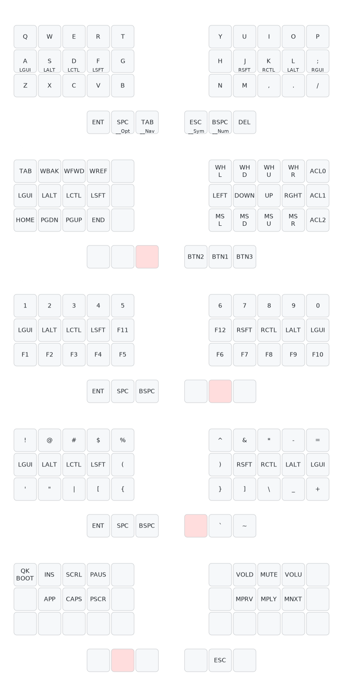

# IBKBD
_Ibrahim's Keyboard_

- Custom physical layout, PCB, Case, and keymap
- 3x5 + 3 (Inspired by Absolem and Corne keyboards)

I wanted to create an ultra portable version of the IBKBD-Full. This version uses low profile choc switches, does not have the gaming layer keys, and is a uni-body design.

#### In this project
- ergogen config

