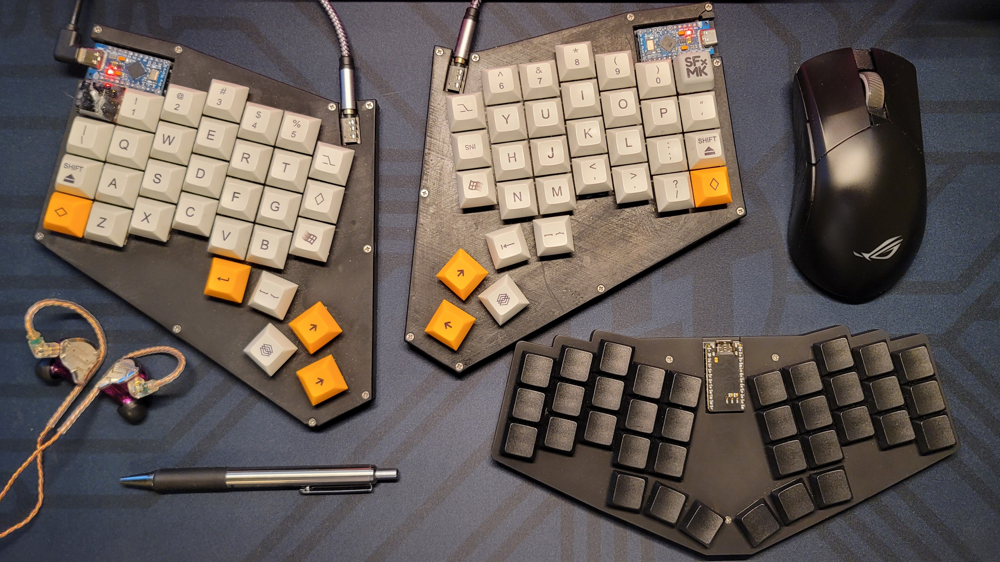
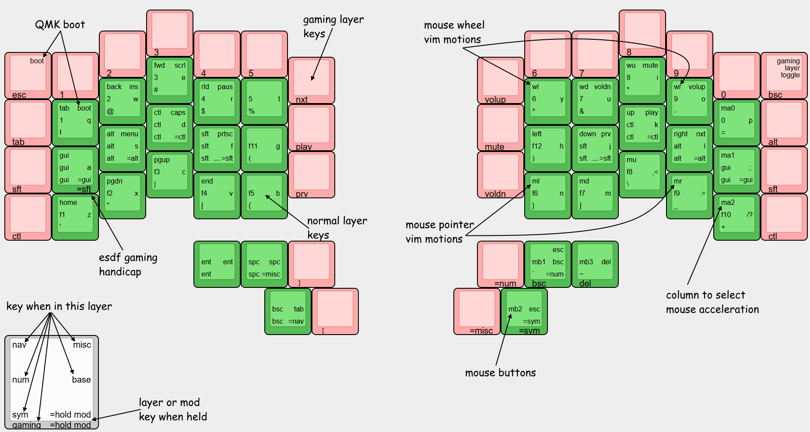

# IBKBD
_Ibrahim's Keyboards_

- IBKBD Full
    - Custom physical layout, PCB, Case, and keymap
    - 4x6 + 5 + 3 _(Inspired heavily by [Dygma Defy](https://dygma.com/products/dygma-defy))_
    - DSA keycaps _(from [amazon](https://www.amazon.com/dp/B07QHRNRGR))_
    - Kailh Midnight Pro Silent Tactile Switches _(locally from [central computers](https://www.centralcomputer.com/))_
    - Pro Micro ATmega32U4 with type C port _(from [amazon](https://www.amazon.com/gp/product/B09J4MP1QK))_
    - check ./ibkbd-full/

